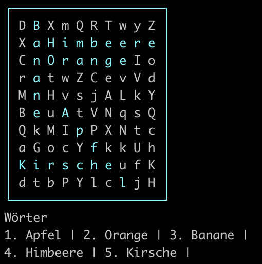

# Word Search Puzzle
A simple word search made in Python

-

## Usage

```
$ python puzzle.py -h              
usage: puzzle.py [-h] [-c] [-f FILE] [-w WIDTH] [--height HEIGHT] [-u] [-l]
                 [-n NUMBER] [-d DIRS] [-b] [--wordslocalized WORDSLOCALIZED]
                 [--spacer SPACER]

Generates a word search puzzle

options:
  -h, --help            show this help message and exit
  -c, --cheated         Hightlight words
  -f FILE, --file FILE  Path to a custom words file. One word per line.
  -w WIDTH, --width WIDTH
                        Sets a custom grid width (Default: 20)
  --height HEIGHT       Sets a custom grid height (Default: width)
  -u, --upper           All upper-case
  -l, --lower           All lower-case
  -n NUMBER, --number NUMBER
                        Number of words to hide
  -d DIRS, --dirs DIRS  Allow directions, bit vector: 1*horizontal + 2*vertical +
                        4*diagonal
  -b, --borders         Print borders
  --wordslocalized WORDSLOCALIZED
                        Words in your language, default: Wörter (German)
  --spacer SPACER       Spacer between letters

```

## Examples:

Create search puzzle with Zelda words:
Default is 20x20, 10 words, no border (so you can easily paste it into other documents using a monospace font).
Also, by default casing will be as given in the text file. Unoccupied fields will be randomly filled with upper or lower case letters. (Use `--upper` or `--lower` to change this.)

```
% python puzzle.py -f zelda_german.txt
Wörter
1. Soldatenschild | 2. Hyliasee | 3. Schleichling | 4. Feuerstein | 5. Ganon | 6. Schleichschnecke | 7. Prinzessin | 8. Eichel | 9. Rüstung | 10. Zahnrad |
G P c S c h l e i c h s c h n e c k e X
O g w E g l P r i n z e s s i n k Y h I
t V e B r B f v f j J u k i m o P j r H
b E X a k P w c f v Q b M K w P l X r l
Z T i E T i C n W i H x d k w a D e p z
l F q c F g d h R d H U q Y E P W E q L
P B f v h Q y X g q P n E a U L n H k P
H S c h l e i c h l i n g C P I e T I U
F y e R R W l V I J E m R ü s t u n g J
p e l i E g U H I M O X x A m I P n N J
L M u i D Y T R p z O b g p J N S y F s
u u o e a w Y b z r G a n o n b n l F b
c z U Y r s S o l d a t e n s c h i l d
A V K U x s e Z a h n r a d j Z b E Z b
l M t J a n t e R N I U q g X i J X E B
S O X C L O r e U V g Q S l D g s M v r
c Q K C r K m j i m h F h d k J g t x w
p l b o G p a E v n i X B e e h p h R Y
v K f d m a F W m L k H t O J V i o w b
z v O n d z r v r c u F W n l n i A k N
```

Create 10x10 puzzle with 5 words, all uppercase:

```
% python puzzle.py -f zelda_german.txt --width 10 --height 10 -n5 -u
Wörter
1. KÖNIG | 2. BOKBOGEN | 3. LINK | 4. GRILLWILD | 5. SCHREIN |
G D J P W K U T P K
R B D R T S Q C Z S
I O S F L I N K H J
L K C I Z G L D S Q
L B H K Ö N I G Q V
W O R Q D X B B W Q
I G E T T S K Q N A
L E I N Y Z C O F V
D N N K I D F Q G Y
M V U M N O K U E T
```

By default, the script places the words horizontally, vertically and diagonally. This can be changed using the `--dirs` argument. This is bit-vector: `1*horizontal + 2*vertical + 4*diagonal`.

E.g.:
* 7: all directions (default)
* 3: only horizontal and vertical
* 1: only horizontal
* 2: only vertical

```
% python puzzle.py -f zelda_german.txt --width 10 --height 10 -n5 -d 3
Wörter
1. Topaz | 2. Ganon | 3. Wächter | 4. Schatz | 5. Erinnerung |
S n T H G T X e g E
G W k q a T r N M r
k ä J G n o U S N i
C c V P o p I c c n
b h l Y n a L h e n
K t E Y B z b a S e
w e B d q p o t S r
b r X X d H V z r u
d j m Q h y i B m n
E V T g S p I k h g
```

# License
This project is licensed under the terms of the MIT license. The MIT License is a permissive license that is short and to the point. It lets people do anything they want with your code as long as they provide attribution back to you and don’t hold you liable.

